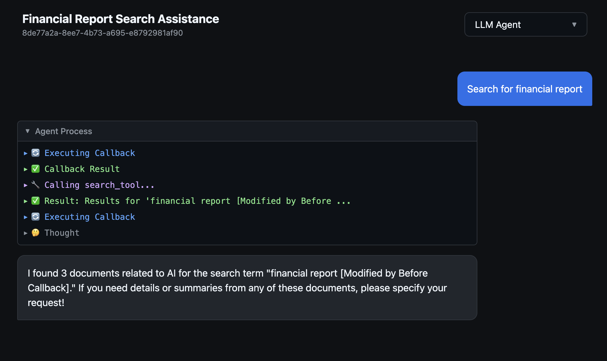

# Agentic Chatbot



# 🧠 Full-Stack Agentic AI Chatbot

* Lightweight chatbot with a **custom agentic AI framework** (built from scratch)
* Implements an event-driven **ReAct loop** (Think → Act → Observe → Answer) + Callbacks
* Real-time streaming of agent reasoning, tool calls, and outputs
* Vanilla JS frontend + FastAPI backend (frotend and backend running on the same machine for simplicity)
* Modular architecture built for extensibility and transparency
* Full conversation history stored in SQLite


## 🚀 Key Features

* **Custom Agent Runtime** managing the full LLM lifecycle
* **Glass-Box UI** revealing real-time agent thoughts and tool usage
* **Event System** streaming granular updates to the client (python async generators)
* **Tool Support & Citations** with structured rendering in the UI
* **Persistent Conversations** powered by SQLite + async SQLAlchemy

## 🛠️ Tech Stack

**Backend (Python)**

* FastAPI
* Async SQLAlchemy + SQLite
* OpenAI API
* Custom Agent Framework (`BaseAgent`, `LLMAgent`, callbacks, tools)
* UV package manager

**Frontend (Vanilla JS)**

* Pure ES6, HTML, CSS
* Custom `ReadableStream` handling multi-event streaming
* Dynamic DOM rendering for thoughts, tools, and responses

## 📂 Structure

```
app/
  agents/      # Agent framework
  api/         # FastAPI routes
  services/    # Business logic
  models/      # Database models
static/        # Frontend JS/CSS
DESIGN.md      # Architecture overview
```

## ⚡ Getting Started

1. **Install**

   ```bash
   make setup # requires uv
   ```
2. **Configure**
   Create `.env` with `OPENAI_API_KEY`.
3. **Run**
    Extremely simple, ui and backend run on the same machine.
    Command bellow starts fastapi server and opens ui in the browser.

   ```bash
   make dev
   ```

   Visit: `http://localhost:8000`

## 🧠 Why a Custom Framework?

* Full control over reasoning loops and context
* Transparent, debuggable agent behavior
* Lightweight and faster than heavy abstractions like LangChain

---

Want an even **shorter** version, a **marketing-style** version, or a **GitHub-optimized** version with images/badges?

